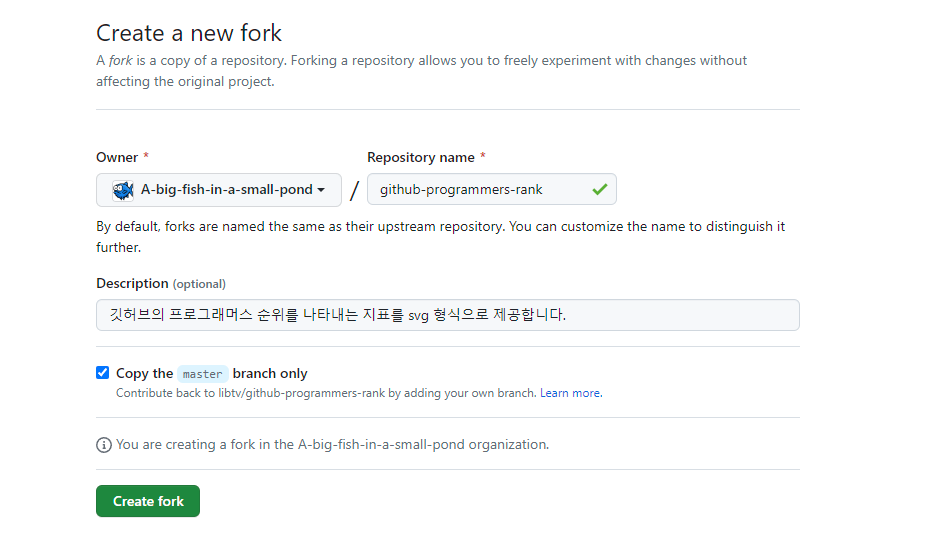
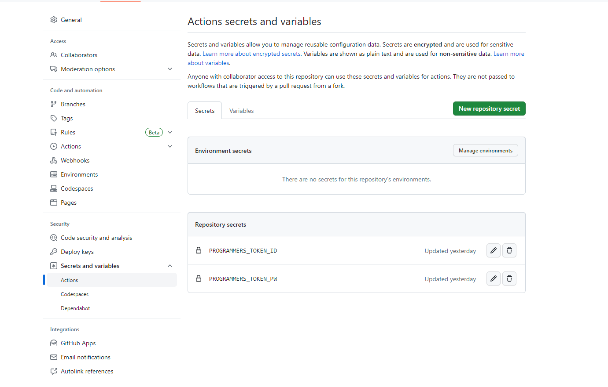
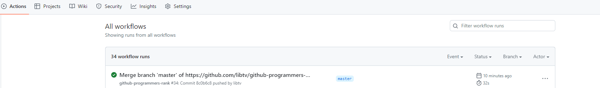

# github-programmers-rank
깃허브의 프로그래머스 순위를 나타내는 지표를 svg 형식으로 제공합니다.

<br>

## 🧑‍🎓 Programmers
[](https://github.com/libtv/github-programmers-rank)
s
<br>

## How to install
### 1. Fork this Project - 이 프로젝트를 포크합니다.



### 2. Apply Secret Key - 시크릿 키를 등록합니다.



PROGRAMMERS_TOKEN_ID - 프로그래머스 아이디

PROGRAMMERS_TOKEN_PW - 프로그래머스 비밀번호

### 3. set Github Action - 깃허브 액션을 설정합니다.

refer: https://github.com/libtv/github-programmers-rank/blob/master/.github/workflows/github-programmers-rank.yml

```yml
# This workflow will do a clean installation of node dependencies, cache/restore them, build the source code and run tests across different versions of node
# For more information see: https://docs.github.com/en/actions/automating-builds-and-tests/building-and-testing-nodejs

name: github-programmers-rank

on:
  push:
    branches: [ "master" ]
  pull_request:
    branches: [ "master" ]
  schedule:
    - cron: '0 5 * * 1-5'

jobs:
  build:
    runs-on: ubuntu-latest

    strategy:
      matrix:
        node-version: [14.x]
        # See supported Node.js release schedule at https://nodejs.org/en/about/releases/

    steps:
    - uses: actions/checkout@v3
    - name: Use Node.js ${{ matrix.node-version }}
      uses: actions/setup-node@v3
      env: 
        PROGRAMMERS_TOKEN_ID: ${{ secrets.PROGRAMMERS_TOKEN_ID }}
        PROGRAMMERS_TOKEN_PW: ${{ secrets.PROGRAMMERS_TOKEN_PW }}
      with:
        node-version: ${{ matrix.node-version }}
        cache: 'npm'
    - run:  echo ${{ secrets.PROGRAMMERS_TOKEN_ID }}
    - run: npm install
    - run: npm run build
    - run: |
        touch .env
        echo PROGRAMMERS_TOKEN_ID=${{ secrets.PROGRAMMERS_TOKEN_ID }} >> .env
        echo PROGRAMMERS_TOKEN_PW=${{ secrets.PROGRAMMERS_TOKEN_PW }} >> .env
        npm run start

  cron:
    runs-on: ubuntu-latest

    strategy:
      matrix:
        node-version: [14.x]
        # See supported Node.js release schedule at https://nodejs.org/en/about/releases/

    steps:
    - uses: actions/checkout@v3
    - name: Use Node.js ${{ matrix.node-version }}
      uses: actions/setup-node@v3
      env: 
        PROGRAMMERS_TOKEN_ID: ${{ secrets.PROGRAMMERS_TOKEN_ID }}
        PROGRAMMERS_TOKEN_PW: ${{ secrets.PROGRAMMERS_TOKEN_PW }}
      with:
        node-version: ${{ matrix.node-version }}
        cache: 'npm'
    - run:  echo ${{ secrets.PROGRAMMERS_TOKEN_ID }}
    - run: npm install
    - run: npm run build
    - run: |
        touch .env
        echo PROGRAMMERS_TOKEN_ID=${{ secrets.PROGRAMMERS_TOKEN_ID }} >> .env
        echo PROGRAMMERS_TOKEN_PW=${{ secrets.PROGRAMMERS_TOKEN_PW }} >> .env
        npm run start
        
```

### 4. Check your Action Flow - 정상적으로 작동되는 지 액션 플로우를 확인합니다.



then, result svg files path is "./lib" : 결과물은 lib 폴더에 존재합니다. 

[](https://github.com/libtv/github-programmers-rank)
